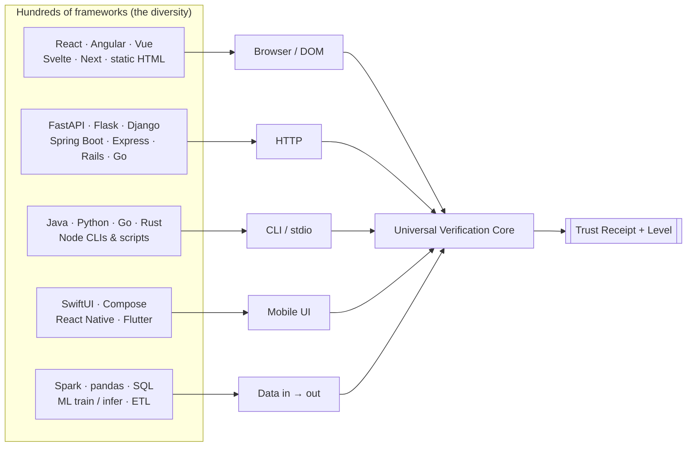
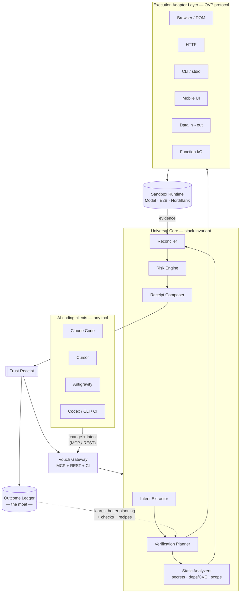
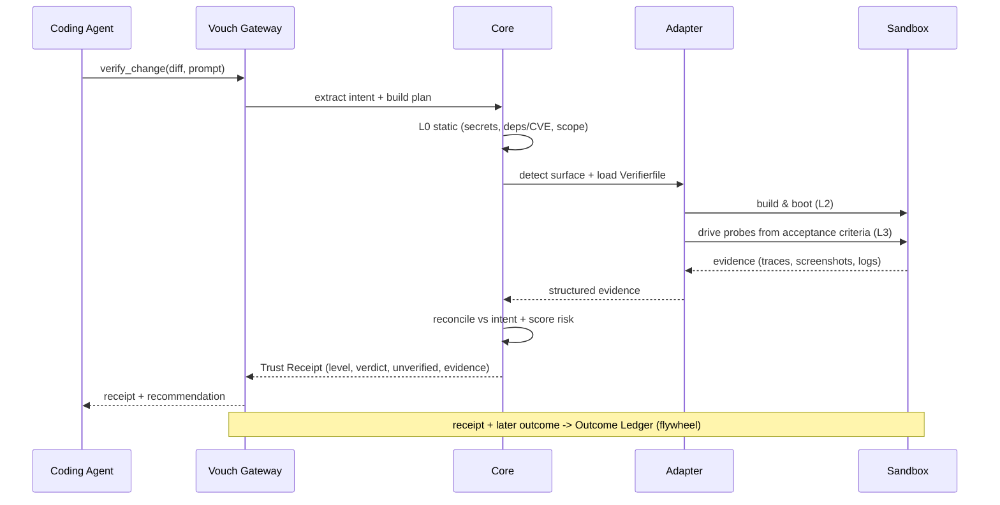
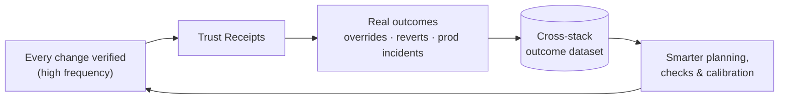
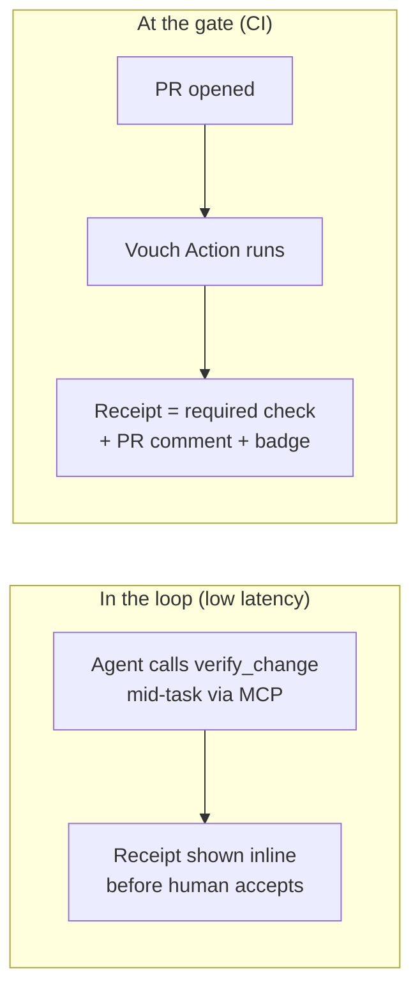
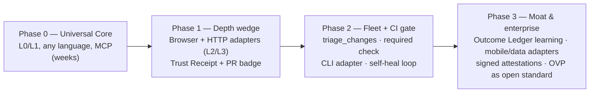

# Vouch — The Trust Layer for AI-Generated Code

> **The neutral, language-agnostic proof layer that sits between every AI coding agent and every merge.**
> It checks what the agent *built* against what you *asked* — at the observable boundary — works across any stack from day one, returns the deepest proof currently achievable (and is honest about the rest), and compounds a cross-stack outcome dataset no single platform can copy.

---

| | |
|---|---|
| **Document** | Vouch Blueprint — master reference |
| **Version** | 0.1.0 |
| **Status** | Living document — the north star. Every spec, PRD, and design decision must reconcile against this file. |
| **Date** | 2026-06-14 |
| **Working name** | **Vouch** (placeholder — see §19 Naming). Verb-able: *"Did Vouch pass?" "Vouch flagged it."* |
| **Lineage** | Evolution of **TrueArch**. Reuses TrueArch's failure corpus, governance DNA, MCP distribution, and neutrality protocol (see §17). |
| **One-line category** | *Verification infrastructure for AI-native software.* The "CI for the AI-coding era." |

### How to use this document
This is the **constitution**, not a backlog. When you write any other doc (PRD, ADR, spec, pitch), open this first and ask: *does this decision align with the Inversion Thesis (§2), the Design Tenets (§5), and the M+N Architecture (§9)?* If something here is wrong, **change this file first**, then cascade. Diagrams render on GitHub / IDE Markdown preview (Mermaid).

---

## Table of Contents

1. [TL;DR — the whole idea in one page](#1-tldr--the-whole-idea-in-one-page)
2. [Why we are building this — the Inversion Thesis](#2-why-we-are-building-this--the-inversion-thesis)
3. [What Vouch is (and is not)](#3-what-vouch-is-and-is-not)
4. [The user & the magic moment](#4-the-user--the-magic-moment)
5. [Design tenets — the DNA](#5-design-tenets--the-dna)
6. [The central insight: verify at the boundary, not the framework](#6-the-central-insight-verify-at-the-boundary-not-the-framework)
7. [The product surface](#7-the-product-surface)
8. [The Trust Receipt — the new primitive](#8-the-trust-receipt--the-new-primitive)
9. [High-level architecture (M+N, not M×N)](#9-high-level-architecture-mn-not-mn)
10. [Low-level design](#10-low-level-design)
11. [The data flywheel & the moat](#11-the-data-flywheel--the-moat)
12. [Integration model](#12-integration-model)
13. [Competitive landscape & positioning](#13-competitive-landscape--positioning)
14. [Risks, failure modes & mitigations](#14-risks-failure-modes--mitigations)
15. [Roadmap](#15-roadmap)
16. [Metrics — north star & guardrails](#16-metrics--north-star--guardrails)
17. [Relationship to TrueArch — what we reuse](#17-relationship-to-truearch--what-we-reuse)
18. [Business model](#18-business-model)
19. [Naming system](#19-naming-system)
20. [Decision log](#20-decision-log)
21. [Open questions](#21-open-questions)
22. [Glossary](#22-glossary)
23. [AI-readable context block](#23-ai-readable-context-block)

---

## 1. TL;DR — the whole idea in one page

**The problem.** In 2026, generating code is free and infinite. Claude Code, Cursor, Antigravity, and Codex each fan out into parallel subagents producing more diffs than any human can read. The scarce resource is no longer *writing* code — it's **trusting** it. The terrifying, dozens-of-times-a-day moment is: *"The agent says it's done. I can't read all 600 lines. I'll accept it and pray."* Nobody owns the gate that answers *"is this safe to ship?"*

**The product.** Vouch is a neutral verification layer, delivered as an MCP server + REST API + CI check. On every agent change it (1) reads the **intent**, (2) **runs** the change in a sandbox and observes it, (3) scans **risk** (secrets, deprecated/CVE deps, blast radius), and (4) **reconciles** what was built against what was asked. It returns a **Trust Receipt**: `Verified · Risky · Rejected`, with a proof **level** and evidence.

**The hard part everyone gets wrong.** The universe of stacks is enormous (React, Spring Boot, SwiftUI, Spark, Flask, Flutter…). The naive approach — a verifier per language×framework×platform — is **M×N**: infinite, undefendable, dead. Vouch escapes it the way LSP and MCP did: a **protocol + a handful of adapters at the few real observation boundaries** (browser, HTTP, CLI, mobile, data, function), turning M×N into **M+N**. Hundreds of frameworks collapse into ~6 observable surfaces.

**Why it's defensible.** Vouch sits at the richest data point in the pipeline — the accept/merge gate — and accumulates the `intent → change → verification → outcome` tuple across *every* stack. That cross-stack outcome dataset is un-retrievable by models, not owned by observability vendors (who see prod traces, not the pre-merge triple), and impossible for a single coding platform to build *neutrally* (no platform will honestly grade a rival's agent — or its own — as "Rejected"). **The diversity that looks like the threat is the moat.**

**The endgame.** The Trust Receipt becomes a **required artifact for merge** — the green check of the AI era. As models get better and generate *more* code, Vouch gets *more* valuable. It is verification infrastructure for autonomous software.

---

## 2. Why we are building this — the Inversion Thesis

### 2.1 The law

> **The Inversion Law:** *As the cost of generating code approaches zero, the value of trusting it approaches infinity.*

For fifty years the bottleneck in software was **production** — writing, typing, implementing. Every tool optimized that. In 2026 that bottleneck collapsed: agents generate correct-looking code faster than humans can read it. The constraint didn't vanish — it **moved downstream** to **verification and trust**. This is a once-per-paradigm dislocation, and the layer that owns the new bottleneck owns the value.

### 2.2 The evidence the bottleneck is real

- Vibe coding is defined by *"accepting AI-generated code without thorough review."* A fully vibe-coded OS was publicly written off as a *"bug-filled disaster"* in March 2026 — generation outran verification and nothing closed the gap.
- Parallel, multi-tool agent execution is now mainstream: Claude Code spawns parallel subagents, Cursor runs cloud background agents, Antigravity 2.0 is built around multi-agent orchestration, and fleet dashboards (e.g. Conductor) exist to run many agents at once. **The human is now a reviewer/conductor of a fleet — and is drowning.**
- Hallucination is down (top models ~1–2%) but *not zero*, and at agent scale a small error rate × enormous volume = many real, shipped defects.

### 2.3 Why now (the timing is rare and specific)

1. **Generation commoditized** — the pain is acute *now*, not theoretical.
2. **The fan-out is here** — parallel agents make manual review structurally impossible, creating demand for an automated gate.
3. **Execution is a commodity** — secure code sandboxes (Modal, E2B, Koyeb, Northflank, Blaxel) mean we *stand on* execution infra instead of building it.
4. **The protocol substrate exists** — MCP achieved near-universal adoption (Anthropic, OpenAI, Google, Microsoft) under Linux Foundation stewardship, so a cross-tool layer has a ready distribution channel.
5. **The pattern is proven** — "Code as Agent Harness" (running/verifying under sandboxes) is now a studied, standard pattern; neutral interception layers (e.g. Open Agent Passport for policy) are emerging. The category is forming; the *correctness* seat is open.

### 2.4 The anti-thesis (why this isn't TrueArch again)

TrueArch's value *shrank* as models improved (it solved accuracy/efficiency — things grounding now gives for free) and it had **no data path** to its moat. Vouch is the inverse on both axes:

| | TrueArch | Vouch |
|---|---|---|
| Value vs. better models | **Shrinks** (models close the gap) | **Grows** (more code → more to verify) |
| Frequency | Once per project | Every change, every day |
| Data path to moat | None (design-time advisor) | **The merge gate** (richest point) |
| Defensibility | Curated facts (perishable) | Protocol + surface-collapse + outcome data |

---

## 3. What Vouch is (and is not)

| ❌ Vouch is NOT | ✅ Vouch IS |
|---|---|
| A coding agent / autocomplete | A **verifier** of other agents' work |
| A linter (language-locked, shallow, no intent) | A **behavioral + intent** proof layer |
| A per-framework test generator (M×N) | A **protocol + ~6 boundary adapters** (M+N) |
| An observability platform (prod traces) | A **pre-merge** trust gate |
| A single-vendor feature | A **neutral, cross-tool** standard |
| A CI plugin per ecosystem | **One gate** that grades any stack to its achievable depth |

**Positioning sentence:** *Vouch is verification infrastructure — the neutral proof layer for AI-generated code.* Tools get replaced; infrastructure compounds.

---

## 4. The user & the magic moment

### 4.1 Who
- **Primary (beachhead):** AI-native builders and small teams shipping fast with Claude Code / Cursor / Antigravity — high volume of generated code, high anxiety, low review capacity.
- **Secondary:** engineering teams adopting parallel/background agents who need a merge gate.
- **Tertiary (Phase 3+):** enterprises needing **auditable, signed** proof of what autonomous agents changed (compliance, supply-chain attestation).

### 4.2 Jobs to be done
- **J1 — Should I accept this?** Turn "accept and pray" into a confident accept or a precise "look here."
- **J2 — Triage the fleet.** "I have 11 diffs from 3 agents — which 3 do I actually review?"
- **J3 — Gate the merge.** Block unsafe changes before they land (CI).
- **J4 — Prove it (upward/audit).** A signed, evidence-backed receipt to defend a change to a reviewer, a CTO, or an auditor.
- **J5 — Self-healing input.** Feed precise, evidence-rich failure context back to the agent so it fixes its own work.

### 4.3 The magic moment
> You run 3 agents across 3 tools overnight. You wake up to 11 diffs. Instead of drowning, you see **"8 Verified · 2 Risky (here's exactly why) · 1 Rejected."** You review the 3 that matter and ship. You just 10×'d output **without** 10×'ing fear.

**The addiction is fear-removal in the core loop**, repeated many times a day. That is the most habit-forming thing a developer tool can do.

---

## 5. Design tenets — the DNA

Every product/eng decision is measured against these.

1. **Verify at the boundary, not the framework.** Behavior is observed at a few surfaces; never build per-framework verifiers.
2. **M+N or it doesn't ship.** If a feature scales with `languages × frameworks`, it is wrong. It must scale with `languages + surfaces`.
3. **Honesty is the product.** Never claim a depth you didn't reach. State what was *not* verified. A truthful "L1 only" beats a false "Verified." One confidently-wrong "Verified" that ships a breach is an extinction event.
4. **Proof, not opinion.** A verdict must carry **evidence** (a trace, a screenshot, an HTTP log, an exit code). No evidence → no claim.
5. **Neutral by structure.** Grade every tool — including the popular one — by the same rule. The honest "your agent's output is bad" is the moat. Never bias toward any vendor.
6. **Graceful degradation.** Be useful on an unknown stack (L0/L1 universal) and deep where it counts (L3 on common surfaces). Never all-or-nothing.
7. **The change carries its proof.** Receipts are portable, signed artifacts ("proof-carrying changes"), not ephemeral UI state.
8. **Stand on commodity execution.** Sandboxes are a buy, not a build. Spend engineering on intent, planning, reconciliation, and the adapter protocol.
9. **The agent does the setup.** Harnesses are bootstrapped agentically and cached (the *Verifierfile*), so the marginal cost of a new stack → 0.
10. **Every verdict enriches the system.** Receipt + real outcome → the Outcome Ledger. Intelligence accumulates; it is not regenerated.

---

## 6. The central insight: verify at the boundary, not the framework

The diversity objection ("there are infinite stacks") is real **at the framework layer** and **false at the observation layer**. The question *"did the change do what was asked?"* is answered by watching the artifact behave — and software exposes behavior through only a handful of surfaces.



**The collapse:** Angular, Svelte, and a static site are *the same problem* — a browser rendering a DOM. FastAPI and Spring Boot are *the same problem* — a process answering HTTP. **Hundreds of frameworks → ~6–7 adapters.** That is what turns infinity into a finite, fundable surface.

### The observable surfaces (the complete adapter set)

| Surface | **One** adapter covers… | Verified via |
|---|---|---|
| **Browser / DOM** | React, Angular, Vue, Svelte, Next, Remix, static, any web UI | Playwright: render, click, network, console |
| **HTTP** | FastAPI, Flask, Django, Spring Boot, Express, Rails, Go, ASP.NET, any API | request → assert status / schema / body / logs |
| **CLI / stdio** | any Java, Python, Go, Rust, Node tool or script | args/stdin → stdout / exit code |
| **Mobile UI** (iOS sim + Android emu = 2) | SwiftUI, Kotlin/Compose, React Native, Flutter | simulator UI automation, screenshot diff |
| **Data in → out** | ETL, Spark, pandas, SQL, ML train/infer | fixture in → assert artifact / metrics / shape / leakage |
| **Function I/O** | any library / pure logic | generated inputs → output invariants |

**This is the architectural constitution.** It is the same move LSP made (N languages × M editors → M+N via a protocol) and MCP made for tools. Vouch makes it for **verification**.

---

## 7. The product surface

Three delivery surfaces, one engine:

1. **MCP server** (primary) — `stdio` for IDE/agent integration, `http` for hosted. Drops into Claude Code, Cursor, Antigravity, Codex, Windsurf via config. The agent calls `verify_change` as part of its own loop.
2. **REST API** — the engine, callable by anything.
3. **CI mode** (GitHub Action / CLI) — the Trust Receipt becomes a PR check + comment; gate merges on policy.

Plus two artifacts:
- **The Trust Receipt** (§8) — portable, signed proof attached to a change/PR. Shareable as a badge.
- **The Verifierfile** — a cached, committable verification recipe per repo (how to build/boot/probe it), authored agentically, refined over time. Like a Dockerfile, but for *proving* the app.

---

## 8. The Trust Receipt — the new primitive

The receipt is the unit of work Vouch creates. *"Don't ship code — ship verified changes."* It is **proof-carrying**: it travels with the change, is signed, and is auditable.

```yaml
receipt_id: "rcpt_01J..."
schema_version: "0.1"

change:
  repo: "acme/payments"
  base: "a1b2c3"
  head: "d4e5f6"
  diff_hash: "sha256:..."
  origin:
    tool: "claude-code"          # claude-code | cursor | antigravity | codex | ci | cli
    agent_run_id: "..."
    prompt_ref: "Add Stripe refund endpoint with idempotency"

intent:
  extracted_from: ["prompt", "linked_ticket", "conversation"]
  claims:                        # what the change asserts it does
    - "adds POST /refunds endpoint"
    - "refunds are idempotent by Idempotency-Key"
  acceptance_criteria:
    - "duplicate key returns the original refund, not a new one"

verification:
  surface: "http"                # browser | http | cli | mobile | data | function
  level_reached: "L3"            # L0 | L1 | L2 | L3   (see levels table)
  verdict: "risky"               # verified | risky | rejected
  confidence: 0.78               # honest uncertainty, never inflated
  sandbox: "modal://run/..."
  duration_ms: 41250

checks:
  - id: "static.secrets"        ; category: "security"   ; status: "pass"
  - id: "deps.deprecated_api"   ; category: "dependency" ; status: "warn"
    detail: "stripe-python 7.x: Refund.create signature changed in 8.x"
    source: "truearch-corpus:STRIPE-002"
  - id: "intent.endpoint_exists"; category: "behavior"   ; status: "pass"
    evidence_ref: "ev_http_1"
  - id: "intent.idempotency"    ; category: "behavior"   ; status: "fail"
    evidence_ref: "ev_http_2"
    detail: "Second call with same Idempotency-Key created a 2nd refund"

evidence:
  - id: "ev_http_1"; type: "http_exchange"; uri: "s3://.../ev1.json"
    summary: "POST /refunds -> 201, body matches schema"
  - id: "ev_http_2"; type: "http_exchange"; uri: "s3://.../ev2.json"
    summary: "2x POST same key -> two distinct refund ids (BUG)"

unverified:                      # the honesty section — never empty by omission
  - "partial-refund path not exercised (no fixture)"
  - "webhook delivery not tested"

risks:
  - id: "R1"; severity: "high"; description: "non-idempotent refund -> double refunds"
  - id: "R2"; severity: "low";  description: "uses soon-deprecated stripe API"

scope_creep:
  - "modified src/auth/session.py — not referenced in stated intent"

recommendation: "review"         # accept | review | reject
human_summary: >
  Endpoint works, but the core idempotency claim FAILED — a duplicate key
  created a second refund. Also touched auth/session.py unexpectedly. Fix
  before merge.

provenance:
  verifier_version: "vouch-0.1.0"
  adapters: ["http@0.1"]
  recipe_ref: "Verifierfile@acme/payments"
  timestamp: "2026-06-14T10:22:31Z"
  valid_until: "2026-06-14T10:22:31Z+head"   # invalid if head moves
  signature: "ed25519:..."                   # attestation / supply-chain
```

### The proof levels (graceful degradation, made explicit)

| Level | Name | What it proves | Stack coupling | Availability |
|---|---|---|---|---|
| **L0** | Static | builds; no secrets; no deprecated/CVE deps; diff matches intent; no scope creep | **Invariant** | **Every stack, day one** |
| **L1** | Self-test | the change's own tests / types pass | Near-invariant (needs test cmd) | Every stack with tests |
| **L2** | Boot | it actually starts / renders / launches without crashing | One adapter per surface | Common surfaces |
| **L3** | Behavioral | driven end-to-end; the *claimed* behavior provably happened (or didn't) | Per surface (premium) | Browser/HTTP first |

**A receipt always states the level reached and what remains unverified.** This single rule is what makes Vouch trustworthy across infinite diversity: it is useful on a stack it has never seen (L0–L1) and deeply trusted where it has an adapter (L3) — and it **never lies about which**.

---

## 9. High-level architecture (M+N, not M×N)



**Reading the diagram:** clients send a change + its intent. The **Universal Core** (stack-invariant) extracts intent, plans the verification, runs static checks, and selects a surface. The **Adapter Layer** (the only stack-aware part, and it's tiny — ~6 adapters speaking one protocol) executes the change in a **commodity sandbox** and returns evidence. The Core reconciles evidence against intent, scores risk, and composes a **Trust Receipt**. Every receipt + its eventual real-world outcome flows to the **Outcome Ledger**, which feeds back to make planning and checks smarter. The dashed loop is the flywheel; the only horizontally-scaling part is the adapter layer, and it scales as `+1 per surface`, not `×1 per framework`.

### Verification lifecycle



---

## 10. Low-level design

### 10.1 The Open Verification Protocol (OVP) — the "LSP for verification"

The contract every adapter implements. This is the heart of M+N: the Core never knows about frameworks, only about this interface.

```typescript
interface VerificationAdapter {
  surface: "browser" | "http" | "cli" | "mobile" | "data" | "function";

  // Can this adapter handle this repo/change? cheap, static signals.
  detect(ctx: RepoContext): { match: boolean; confidence: number };

  // Produce or load a cached run recipe (the Verifierfile).
  // Bootstrapped agentically on first run; cached thereafter.
  prepare(ctx: RepoContext): Promise<Harness>;     // -> build/setup commands

  // L2: start the artifact. Returns a handle to a running/loadable target.
  boot(harness: Harness, sandbox: Sandbox): Promise<Target>;

  // L3: drive the target against acceptance criteria, collect evidence.
  probe(target: Target, plan: ProbePlan): Promise<Evidence[]>;

  teardown(target: Target): Promise<void>;

  capabilities(): { levels: ProofLevel[]; cost_hint: CostBand };
}
```

- **Evidence is a closed, typed vocabulary** (`http_exchange`, `dom_snapshot`, `screenshot`, `stdout`, `exit_code`, `metric`, `artifact_diff`, …) so the Core reconciles uniformly regardless of surface.
- **Adapters are independently versioned and sandboxed.** Community/third-party adapters are first-class (the LSP ecosystem model). The protocol is the open standard; the Core + Ledger are proprietary.

### 10.2 The Universal Core (stack-invariant — ~60–70% of value, zero adapters)

| Component | Responsibility | Notes |
|---|---|---|
| **Intent Extractor** | prompt + ticket + conversation → structured `claims[]` + `acceptance_criteria[]` | LLM; the quality ceiling of L3 lives here |
| **Verification Planner** | intent + diff → plan: which surface, which probes, which budget | Learns from the Ledger |
| **Static Analyzers** | secrets, entropy, deprecated-API / CVE / dependency risk, diff & scope-creep analysis | **Deprecation/CVE = TrueArch corpus** |
| **Reconciler** | evidence ↔ intent → per-claim pass/fail + scope-creep | Pure over typed evidence — stack-agnostic |
| **Risk Engine** | severity + blast radius from checks & diff | Produces `risks[]` |
| **Receipt Composer** | assemble level, verdict, confidence, unverified, signature | Enforces honesty rules |

**Verdict rule (deterministic, auditable):**
- `rejected` — any failed acceptance criterion *or* high-severity risk (secret leak, known-exploitable CVE, build break).
- `risky` — unresolved warnings, scope creep, or level below what the change's stated risk warrants.
- `verified` — all stated criteria proven at the appropriate level, no high risks, scope matches intent.
Confidence is reported separately and **never** rounded up.

### 10.3 Agentic harness generation + the Verifierfile

First time Vouch sees a repo, a **setup agent** inspects it (README, Dockerfile, lockfiles, framework markers), determines build/boot/probe steps, and writes a **Verifierfile** — committable, reviewable, cached.

```yaml
# .vouch/Verifierfile
surface: http
build: ["pip install -r requirements.txt"]
boot:  ["uvicorn app.main:app --port $PORT"]
ready: { http_get: "/health", expect_status: 200, timeout_s: 30 }
fixtures:
  seed: ["python scripts/seed_test_db.py"]
  env: { STRIPE_KEY: "sk_test_..." }
probes_hint: "auth via POST /login then bearer token"
```

**Consequence:** marginal cost of a new stack → 0 (agent bootstraps, cache amortizes), *and* accepted recipes become proprietary knowledge ("how to actually spin up and prove a Spring Boot + Kafka + Postgres app").

### 10.4 Sandbox execution layer

- **Buy, don't build.** Pluggable backend over Modal / E2B / Northflank / Koyeb / Blaxel. Vouch defines a thin `Sandbox` interface (spin up, mount diff, run, capture, destroy); the provider is config.
- **Isolation & safety:** ephemeral, network-egress-controlled, secret-scoped, no prod access. Treat all generated code as adversarial (it may contain prompt-injected or malicious behavior).
- **Cost control:** L0/L1 run without a sandbox; L2/L3 are budgeted, cached by `diff_hash`, and short-circuited on early failure.

### 10.5 MCP tool contracts

| Tool | Input | Output |
|---|---|---|
| `verify_change` | diff or PR ref, optional intent hint | Trust Receipt |
| `triage_changes` | list of changes (fleet) | receipts ranked by trust/risk |
| `explain_receipt` | receipt_id | plain-language summary + next actions |
| `verification_status` | repo | achievable levels, missing adapters/fixtures |
| `get_verifierfile` / `set_verifierfile` | repo | the cached recipe |

### 10.6 Data model (Outcome Ledger)

Append-only store of `(receipt, override?, outcome?)`:
- `override` — did a human accept-despite-risky, or reject-despite-verified? (calibration signal)
- `outcome` — did it later break in prod / get reverted / pass clean? (ground truth)
This triple, **across stacks**, is the training corpus for better planning, better checks, and calibrated confidence. See §11.

---

## 11. The data flywheel & the moat



**Three stacked moats:**

1. **Protocol adoption (network moat).** OVP + the Trust Receipt schema become the standard others build on (open spec; LSP/MCP playbook). Vocabulary lock-in.
2. **Surface collapse (engineering-leverage moat).** ~6 adapters cover the field. Competitors who go per-framework drown in M×N; we don't.
3. **Outcome data (data moat).** The `intent → change → verification → outcome` tuple, **across every stack**, at the merge gate. This is:
   - **un-retrievable** — no model can *generate* "what AI-written bugs look like and which checks catch them"; it must be *observed*;
   - **not owned by incumbents** — observability vendors see *prod traces*, not the *pre-merge triple*;
   - **structurally un-buildable by a single platform** — neutrality requires grading rivals (and oneself) honestly, which a platform won't do;
   - **compounding with diversity** — the more varied the usage, the richer and less copyable the dataset.

> **The inversion of the diversity objection:** heterogeneity is not the threat to Vouch — it is the moat, because cross-stack proof + cross-stack outcome data is exactly what no single platform will or can build neutrally.

---

## 12. Integration model



- **Inline (MCP):** the agent verifies its *own* work before declaring done; the human sees the receipt at the accept moment. Highest frequency, highest addiction.
- **Gate (CI):** Trust Receipt as a required status check; policy decides what blocks. This is the path to "required merge artifact."
- **Fleet:** `triage_changes` ranks a pile of agent PRs so the human reviews only what's flagged.
- **Self-heal:** a `rejected`/`risky` receipt is structured, evidence-rich feedback an agent can consume to fix itself — closing the loop.
- **Config reuse:** ship the same multi-client MCP config matrix as TrueArch (`mcp-configs/` for Claude Code, Cursor, Antigravity, Windsurf, Zed, VS Code, Continue).

---

## 13. Competitive landscape & positioning

| Player / category | What they own | Why they don't own *neutral pre-merge correctness* |
|---|---|---|
| **Coding platforms** (Claude Code, Cursor, Antigravity, Codex) | Generation; some self-check | Won't neutrally grade rivals — or themselves — as "Rejected"; conflict of interest |
| **Observability/eval** (LangSmith, Arize, Braintrust, Langfuse) | Prod traces, LLM-output eval | See *runtime traces*, not the *pre-merge intent↔change↔verdict* triple |
| **Sandbox infra** (Modal, E2B, Northflank, Koyeb) | Secure execution | Primitives we build *on*, not a verdict/intent/data layer |
| **CI / code scanners** (GitHub Actions, Snyk, Socket, Semgrep) | Tests, SAST, dep/supply-chain | Per-ecosystem, no intent reconciliation, no behavioral proof of *the change's claim* |
| **Policy interceptors** (Open Agent Passport) | Runtime *authorization* | Complementary — *may I do this?* vs Vouch's *did it do what was asked, correctly?* |

**The open seat:** neutral, cross-stack, pre-merge **correctness-against-intent with evidence.** No one owns it.

---

## 14. Risks, failure modes & mitigations

| Risk | Severity | Mitigation |
|---|---|---|
| **A confidently-wrong "Verified" ships a breach** | **Critical** | Honesty rules (always surface `unverified`); conservative verdict logic; calibrated confidence from the Ledger; never claim un-run behavior |
| **L3 is genuinely hard** (precise intent + correct drive-scripts) | High | It's *agentic + per-surface*, not per-framework; start with most-drivable surfaces (browser/HTTP); cached Verifierfiles |
| **Stateful / auth'd apps need fixtures/seeding** | High | Verifierfile `fixtures`; agentic fixture synthesis; degrade to L1 honestly when unmet |
| **Platforms add shallow self-check** | Medium | Cross-tool neutrality + outcome data are the defenses they can't replicate quickly |
| **Sandbox cost blows up** | Medium | L0/L1 sandbox-free; budget caps; `diff_hash` caching; early short-circuit |
| **Malicious generated code in sandbox** | Medium | Egress control, secret scoping, no prod creds, ephemeral isolation |
| **ML "is the model *good*"** out of reach | Medium | Explicitly out of scope; verify *runs/converges/no-leakage/deps-pinned* and **say so**. Don't overclaim |
| **Adapter long-tail demand** | Low | OVP is open → community/agent-authored adapters; we own the highest-volume surfaces |

**Anti-goals (never do these):** become a coding agent; grade to flatter a platform; claim a depth not reached; build a per-framework verifier; gate on style/opinion rather than proof.

---

## 15. Roadmap



- **Phase 0 (weeks):** ship `verify_change` doing L0/L1 across all languages via MCP. Instant breadth, zero adapters. Distribute free; reuse TrueArch MCP config matrix. *Goal: the first "oh, it caught that" moment.*
- **Phase 1:** Browser + HTTP adapters → real L3 on the apps that dominate vibe coding. Trust Receipt + shareable PR badge (virality + authority). *Goal: the magic moment.*
- **Phase 2:** fleet triage + CI required-check + self-heal feedback. *Goal: become workflow-mandatory.*
- **Phase 3:** Outcome-Ledger learning, mobile/data adapters, signed attestations, OVP published as an open standard. *Goal: the moat deepens; receipts become required merge artifacts.*

---

## 16. Metrics — north star & guardrails

- **North star:** *Verified changes shipped with confidence* — count of merges gated by a Vouch receipt where the human accepted without manual deep review **and** no revert/incident followed.
- **Leading:** % of agent changes verified; L2/L3 coverage rate; median time-to-receipt; receipts per active user per day (frequency = addiction).
- **Quality (the ones that matter most):** **false-"Verified" rate** (must trend to ~0 — the trust killer) and **calibration** (does stated confidence match observed outcomes from the Ledger).
- **Anti-metrics (do NOT optimize):** raw verdict volume, "looks thorough" report length, or anything that incentivizes overclaiming depth.

---

## 17. Relationship to TrueArch — what we reuse

Vouch is the **pivot that makes TrueArch's best assets pay off** by giving them the data path and frequency TrueArch lacked.

| TrueArch asset | Becomes in Vouch |
|---|---|
| **Failure / known-issues corpus** (deprecated APIs, CVEs, "X is in maintenance mode") | The **Static Analyzers' deprecation/CVE brain** (L0) — language-agnostic lookup |
| **Governance DNA** (confidence scores, review-by, provenance, audit) | The **Trust Receipt's** auditable, signed structure |
| **Neutrality Protocol** | Vouch's structural neutrality (grade every tool the same) |
| **MCP server + multi-client config matrix** | Vouch's distribution, ported verbatim |
| **Architecture Genome** (encode a decision) | Generalizes to a **verification fingerprint** per change |
| **Scoring rigor / determinism** | The deterministic, explainable **verdict logic** |

**Reframe:** TrueArch was a design-time advisor queried a few times per project. Vouch is the **same DNA — neutral, auditable, MCP-delivered — relocated to change-time**, where it is invoked dozens of times a day, sits in the data path, and grows more valuable as models improve.

---

## 18. Business model

- **Primary:** usage-based (per verification), with aggressive caching by `diff_hash` for strong gross margins. L0/L1 are cheap (no sandbox); L2/L3 priced to cover sandbox cost + margin.
- **Free tier:** generous L0/L1 + limited L2/L3 → adoption and virality (the badge spreads).
- **Team/enterprise:** CI gating, policy, **signed attestations** for compliance/supply-chain, private adapters, audit retention.
- **Open + closed split (Stripe/HashiCorp playbook):** *open* — OVP spec, Trust Receipt schema, reference adapters; *closed* — the Core (intent/plan/reconcile), the Outcome Ledger, and calibration intelligence.

---

## 19. Naming system

**Working name: Vouch** — verb-able, trust-centric, short, brandable. Treat as a placeholder pending domain/trademark check.

| Layer | Working name |
|---|---|
| Product | **Vouch** |
| The protocol | **OVP — Open Verification Protocol** |
| The artifact | **Trust Receipt** (a.k.a. *attestation*) |
| The cached recipe | **Verifierfile** |
| The data moat | **Outcome Ledger** |
| The proof depths | **L0–L3** |

**Alternatives if Vouch is taken:** *Verdict, Attest, Proof, Greenlight, Notary, Keystone* (keystone = the stone that locks an arch — a nod to the TrueArch lineage).

---

## 20. Decision log

> Record every major decision here with rationale + alternatives rejected.

- **DL-001 — Category: verification infrastructure** (not a coding agent, not a linter). *Rationale:* the bottleneck moved from generation to trust; own the new bottleneck. *Rejected:* "better agent," "AI linter."
- **DL-002 — M+N via observable-surface collapse** as the architectural constitution. *Rationale:* the only way to beat M×N diversity; proven by LSP/MCP. *Rejected:* per-framework verifiers.
- **DL-003 — Honesty/tiered proof (L0–L3) over uniform claims.** *Rationale:* one false "Verified" is an extinction event; graceful degradation makes us useful everywhere. *Rejected:* binary pass/fail.
- **DL-004 — Buy execution (sandboxes), build intelligence.** *Rationale:* sandboxes are commoditized; the moat is intent/reconcile/data. *Rejected:* building sandbox infra.
- **DL-005 — Pivot from TrueArch, reuse assets.** *Rationale:* gives TrueArch's corpus/governance the data path it lacked. *Rejected:* abandoning prior work; continuing TrueArch as-is.
- **DL-006 — Open protocol, closed core + ledger.** *Rationale:* ecosystem adoption + defensible moat. *Rejected:* fully open, fully closed.

---

## 21. Open questions

| Question | Priority |
|---|---|
| Domain / trademark for "Vouch" (and fallback name) | Critical |
| Default sandbox provider for v0 (Modal vs E2B vs self-host) | High |
| Intent extraction: how much to infer vs require explicitly from the user/agent | High |
| Verdict policy defaults (what blocks a merge out of the box) | High |
| Confidence calibration method before the Ledger has data (cold start) | High |
| First two adapters' exact probe DSL | Medium |
| Receipt signing / attestation format (align with SLSA / in-toto?) | Medium |
| Pricing units & free-tier limits | Medium |

---

## 22. Glossary

- **Trust Receipt** — signed, evidence-backed verdict on a change (`Verified · Risky · Rejected` + level + unverified).
- **Observable surface** — a behavior-exposure boundary (browser, HTTP, CLI, mobile, data, function). The unit of adapter, not the framework.
- **OVP (Open Verification Protocol)** — the adapter interface; the "LSP for verification."
- **Verifierfile** — cached, committable per-repo recipe for build/boot/probe.
- **Proof level (L0–L3)** — depth of verification achieved; always reported.
- **Outcome Ledger** — append-only `(receipt, override, outcome)` store; the data moat.
- **M+N vs M×N** — scaling with `languages + surfaces` (good) vs `languages × frameworks` (fatal).
- **Proof-carrying change** — a change that travels with its verification proof.

---

## 23. AI-readable context block

```yaml
product:
  name: Vouch
  working_name: true
  category: "Verification infrastructure for AI-generated code"
  one_liner: "Neutral, language-agnostic proof layer between every AI coding agent and every merge"
  lineage: "Pivot/evolution of TrueArch; reuses failure corpus, governance, MCP distribution, neutrality"

thesis:
  inversion_law: "As generation cost -> 0, the value of trusting code -> infinity"
  bottleneck: "trust/verification, not generation"
  timing: ["generation commoditized", "parallel multi-tool agents", "sandboxes commoditized", "MCP universal"]

core_insight:
  statement: "Verify at the observable boundary, not the framework"
  surfaces: [browser, http, cli, mobile, data, function]
  scaling: "M+N (languages + surfaces), never M x N"

architecture:
  universal_core: [intent_extractor, planner, static_analyzers, reconciler, risk_engine, receipt_composer]
  adapter_layer: "OVP protocol; ~6 surface adapters; community-extensible"
  execution: "commodity sandboxes (Modal/E2B/Northflank); buy not build"
  artifact: "Trust Receipt (signed, evidence-backed, leveled L0-L3)"
  cache: "Verifierfile per repo (agentically bootstrapped)"
  moat: "Outcome Ledger: cross-stack (intent->change->verification->outcome)"

principles:
  - verify_at_boundary_not_framework
  - m_plus_n_or_it_doesnt_ship
  - honesty_is_the_product
  - proof_not_opinion
  - neutral_by_structure
  - graceful_degradation
  - change_carries_its_proof
  - buy_execution_build_intelligence
  - agent_does_the_setup
  - every_verdict_enriches_the_system

surfaces_of_delivery: [mcp_server, rest_api, ci_action]
jobs: [should_i_accept, triage_the_fleet, gate_the_merge, prove_it, self_heal_input]

moat_layers:
  - protocol_adoption        # OVP + receipt schema as standard
  - surface_collapse         # ~6 adapters cover the field
  - outcome_data             # un-retrievable, neutral, compounding with diversity

anti_goals:
  - become_a_coding_agent
  - grade_to_flatter_a_platform
  - claim_unreached_depth
  - per_framework_verifier
  - gate_on_style_not_proof

endgame: "Trust Receipt becomes a required artifact for merge — the green check of the AI era"
```

---

> *Vouch — don't ship code, ship verified changes.*

*Last updated: 2026-06-14 · v0.1.0 · Update this file first whenever the vision or architecture changes; cascade to all other docs.*
